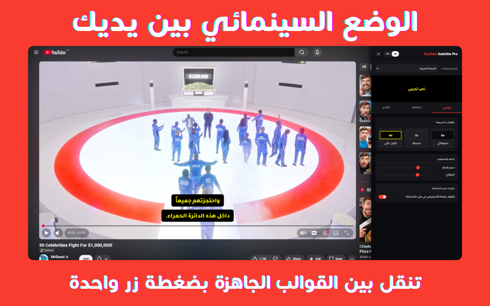
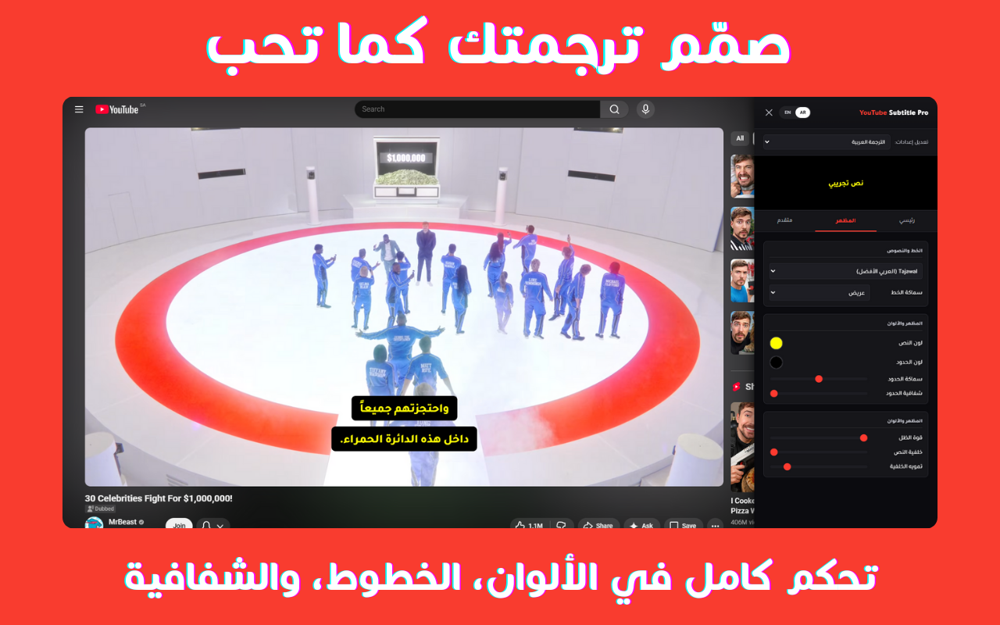

  
  <h1>YouTube Subtitle Pro</h1>
  
<b>ارتقِ بمشاهدة يوتيوب إلى تجربة سينمائية احترافية</b>

  
  
  

   

  [🇺🇸 English](README.md) | [🇸🇦 العربية](README.ar.md)

  

<h2 align="right">🌟 نظرة عامة</h2>

  <b>YouTube Subtitle Pro</b> هي الأداة المتكاملة لتخصيص ترجمات يوتيوب. صممت خصيصاً لتلبية احتياجات المشاهد العربي، حيث تعالج مشاكل تباعد الحروف وتضيف تأثيرات سينمائية مذهلة تجعل القراءة أكثر متعة وسهولة.

<h2 align="right">🚀 الجديد في الإصدار 2.0.1</h2>

| الميزة | الوصف |
| :--- | :--- |
| **📺 دعم النوافذ المضمنة** | دعم كامل لتشغيل الأداة داخل المواقع الخارجية (iframes). |
| **🔒 وضع الخصوصية** | متوافق تماماً مع وضع الخصوصية المحسن ليوتيوب (`youtube-nocookie.com`). |
| **💾 القوالب الذكية** | احفظ تنسيقاتك المفضلة وتنقل بينها بضغطة زر واحدة. |
| **🅰️ دقة الخط العربي** | تقنية "التوزيع الذكي" لضمان ظهور الحروف العربية بشكل مثالي. |

  

<h2 align="right">📦 طريقة التثبيت</h2>

بما أن الإضافة قيد المراجعة في المتجر حالياً، يمكنك تثبيتها يدوياً في أقل من دقيقة:

<ol dir="rtl" align="right">
  <li><b>التحميل:</b> حمل ملف <b><code>YouTube-Subtitle-Pro-v2.0.1.zip</code></b> من صفحة <a href="https://github.com/voidksa/YouTube-Subtitle-Pro/releases/latest">Releases</a>.</li>
  <li><b>فك الضغط:</b> استخرج الملف المحمل إلى مجلد عادي.</li>
  <li><b>التثبيت:</b>
    <ul>
      <li>افتح الرابط التالي في متصفحك: <code>chrome://extensions</code></li>
      <li>فعل <b>"وضع المطور"</b> (في الزاوية العلوية اليمنى).</li>
      <li><b>اسحب وأفلت</b> المجلد المستخرج داخل الصفحة.</li>
    </ul>
  </li>
</ol>

<h2 align="right">✨ المميزات الرئيسية</h2>
<h3 align="right">🌍 ذكاء ثنائي اللغة</h3>
<ul dir="rtl" align="right">
  <li><b>ملفات تعريف منفصلة:</b> خصص تنسيقاً مستقلاً للعربية يختلف تماماً عن الإنجليزية (الحجم، الخط، اللون).</li>
  <li><b>الكشف التلقائي:</b> تتعرف الأداة تلقائياً على لغة الترجمة وتطبق التنسيق الخاص بك فوراً.</li>
</ul>

<h3 align="right">🎨 تخصيص بلا حدود</h3>
<ul dir="rtl" align="right">
  <li><b>النصوص:</b> اختر نوع الخط، الحجم، السمك، واللون المفضل لديك.</li>
  <li><b>المظهر:</b> تحكم في شفافية الخلفية، الحواف، وتأثير <b>التمويه السينمائي (Blur)</b>.</li>
</ul>

<h2 align="right">⌨️ اختصارات لوحة المفاتيح</h2>

| الاختصار | الوظيفة |
| :--- | :--- |
| **`Alt + S`** | ⚙️ فتح/إغلاق لوحة الإعدادات السريعة |
| **`Alt + ⬆️`** | ➕ زيادة حجم الخط |
| **`Alt + ⬇️`** | ➖ تصغير حجم الخط |

<h2 align="right">📜 سجل التغييرات</h2>

<h3 align="right">[2.0.1] - 2026-01-09</h3>
<ul dir="rtl" align="right">
  <li>دعم الفيديوهات المضمنة (iframes) ووضع الخصوصية المحسن.</li>
  <li>تحسين منطق اكتشاف نوافذ الترجمة في مختلف أنواع المشغلات.</li>
  <li>إصلاح مشكلة رقم الإصدار الثابت في ملفات التصدير.</li>
</ul>

<h3 align="right">[2.0.0] - 2026-01-08</h3>
<ul dir="rtl" align="right">
  <li>الإصدار الاحترافي الأول مع دعم التمويه السينمائي والتحسينات العربية المتقدمة.</li>
</ul>

<h2 align="right">⚖️ التراخيص</h2>

  مرخص بموجب <b>CC BY-NC-SA 4.0</b>. 
  <i>للاستخدام الشخصي فقط. يمنع منعاً باتاً إعادة التوزيع التجاري أو الرفع على المتاجر.</i>

