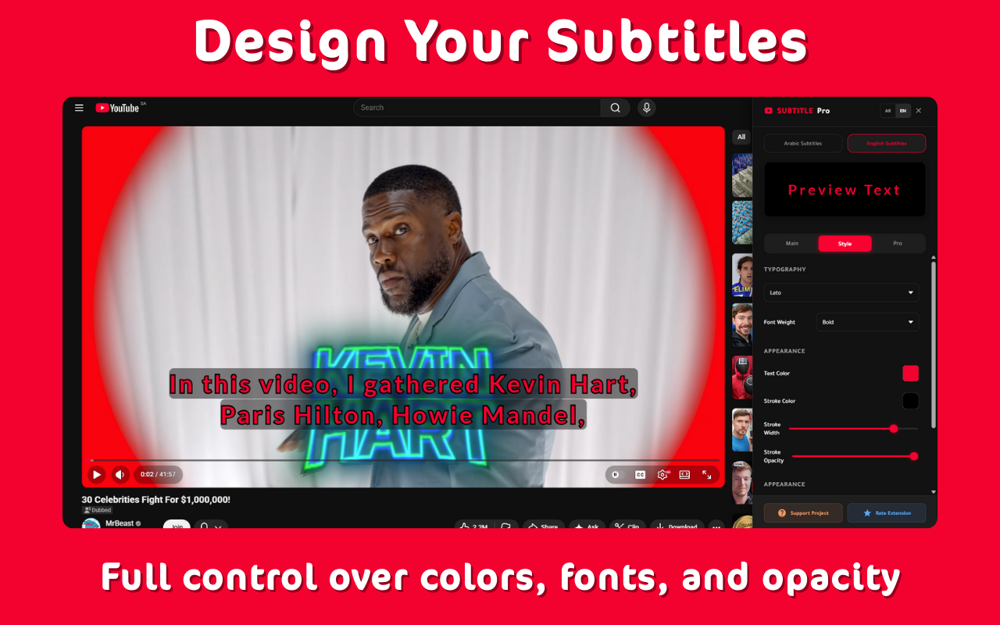

  
  <h1>YouTube Subtitle Pro</h1>
  
<b>Elevate Your YouTube Viewing with Cinematic Subtitles</b>

  
  
  
  

   

  [🇺🇸 English](README.md) | [🇸🇦 العربية](README.ar.md)

  

## 🌟 Overview
**YouTube Subtitle Pro** transforms standard YouTube captions into professional, easy-to-read subtitles. Designed for language learners and cinephiles, it fixes Arabic spacing issues and adds stunning cinematic blur effects.

## 🚀 What's New in v2.2.0
| Feature | Description |
| :--- | :--- |
| **🧠 Smart Timing** | Automatically hides distraction tags like `[Music]`, `(Applause)` and empty lines for cleaner reading. |
| **📂 Custom Fonts** | Upload your own local font files (TTF/OTF/WOFF) directly to the extension and save them. |
| **⏱️ Playback & Timing** | New unified section merging **Playback Speed** and **Subtitle Delay** for better sync control. |
| **🎨 UI Polish** | Fixed RTL dropdown alignment and arrow positioning for Arabic users. |

<!-- Installation guide removed -->

## ✨ Key Features
### 🌍 Bilingual Intelligence
*   **Dual Profiles:** Separate font styles and sizes for English and Arabic.
*   **Auto-Detection:** Automatically detects the subtitle language and applies your preferred style.

### 🎨 Total Customization
*   **Typography:** Choose your font family, size, weight, and color.
*   **Aesthetics:** Adjust background opacity, padding, and cinematic **Background Blur**.

## ⌨️ Keyboard Shortcuts
| Shortcut | Action |
| :--- | :--- |
| **`Alt + S`** | ⚙️ Toggle Quick Settings Panel |
| **`Alt + ⬆️`** | ➕ Increase Font Size |
| **`Alt + ⬇️`** | ➖ Decrease Font Size |

## 📜 Changelog
### [2.2.0] - 2026-02-05
- **Smart Timing:** Enhanced detection for music notes and descriptive text (e.g., `(Dramatic Music)`) with expanded keyword support.
- **Custom Fonts:** Added support for uploading local font files (TTF/OTF) with persistent storage.
- **Playback & Timing:** Merged Playback Speed, Subtitle Delay, and Smart Timing into a unified section.
- **Firefox Parity:** Added missing keyboard shortcuts to Firefox version.
- **UI Improvements:** Fixed RTL dropdown arrow overlap and adjusted padding for Arabic interface.

### [2.1.1] - 2026-01-30
- **Smart Custom Support:** Added a new toggle to enable advanced custom effects for subtitles.
- **Light Mode Fixes:** Resolved invisible toggle buttons, sliders, and color contrast issues in Light Mode.
- **Firefox Compatibility:** Ensured consistent UI styling across Chrome and Firefox.

### [2.1.0] - 2026-01-20
- **Visual Transformation:** Introduced a professional **Solid Dark UI** for a distraction-free, cinematic experience.
- **Smart Engine:** Enhanced detection algorithm that perfectly distinguishes between standard and creator-styled captions.
- **Typography Suite:** Added premium fonts including **Tajawal, Noto Kufi, Almarai** (Arabic) and **Inter, Montserrat** (English).
- **RTL Perfection:** Fully corrected layout directions, slider gradients, and dropdown positioning for Arabic users.
- **Preview Intelligence:** Fixed subtitles covering video preview thumbnails by automatically scaling them down.
- **Auto-Spacing:** Solved text overlap issues by dynamically linking line height to padding.

### [2.0.2] - 2026-01-09
- Fixed keyboard conflicts when typing in settings inputs (preventing YouTube player shortcuts).
- Fixed scrolling and transparency issues inside the settings panel (especially when not in fullscreen).

### [2.0.1] - 2026-01-09
- Added support for embedded YouTube videos (iframes) and Privacy Mode.
- Improved subtitle detection logic across all player types.
- Fixed hardcoded versioning in settings export.

### [2.0.0] - 2026-01-08
- Initial Pro release featuring cinematic blur and advanced Arabic support.

## ⚖️ License
Licensed under **CC BY-NC-SA 4.0**.
*For personal use only. Redistribution or commercial use is strictly prohibited.*
