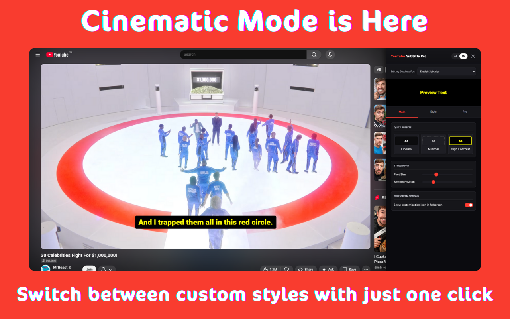
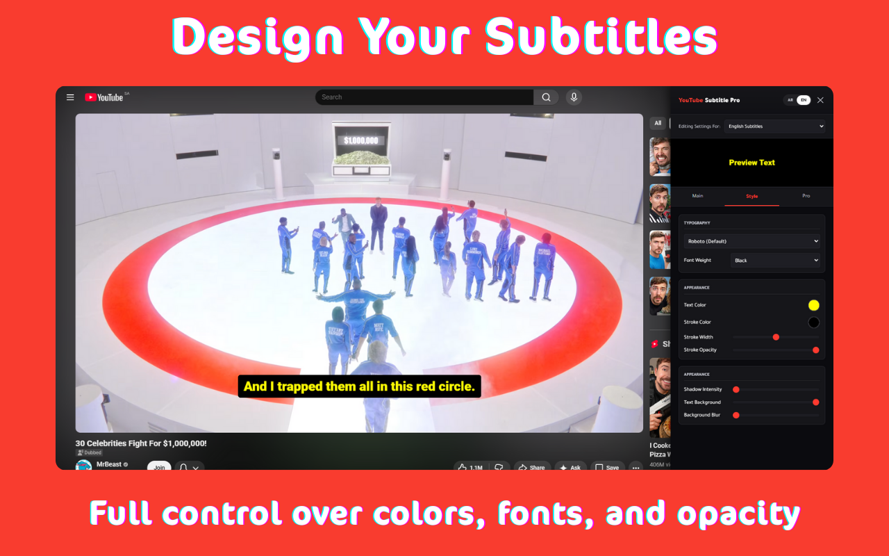

  
  <h1>YouTube Subtitle Pro</h1>
  
<b>Elevate Your YouTube Viewing with Cinematic Subtitles</b>

  
  
  

   

  [🇺🇸 English](README.md) | [🇸🇦 العربية](README.ar.md)

  

## 🌟 Overview
**YouTube Subtitle Pro** transforms standard YouTube captions into professional, easy-to-read subtitles. Designed for language learners and cinephiles, it fixes Arabic spacing issues and adds stunning cinematic blur effects.

## 🚀 What's New in v2.0.1
| Feature | Description |
| :--- | :--- |
| **📺 Universal Embeds** | Full support for YouTube videos on any website (iframes). |
| **🔒 Privacy Mode** | Compatible with YouTube's Privacy-Enhanced Mode (`youtube-nocookie.com`). |
| **💾 Smart Templates** | Save custom styles and switch between them instantly. |
| **🅰️ Arabic Precision** | "Smart Spacing" technology for flawless Arabic rendering. |

  

## 📦 Installation Guide
Since the extension is currently under review in the Web Store, you can install it manually in less than a minute:

1.  **Download:** Get **`YouTube-Subtitle-Pro-v2.0.1.zip`** from the [Releases](https://github.com/voidksa/YouTube-Subtitle-Pro/releases/latest) page.
2.  **Unzip:** Extract the downloaded file to a normal folder.
3.  **Install:**
    *   Open `chrome://extensions` in your browser.
    *   Enable **Developer mode** (top right corner).
    *   **Drag and drop** the unzipped folder into the page.

## ✨ Key Features
### 🌍 Bilingual Intelligence
*   **Dual Profiles:** Separate font styles and sizes for English and Arabic.
*   **Auto-Detection:** Automatically detects the subtitle language and applies your preferred style.

### 🎨 Total Customization
*   **Typography:** Choose your font family, size, weight, and color.
*   **Aesthetics:** Adjust background opacity, padding, and cinematic **Background Blur**.

## ⌨️ Keyboard Shortcuts
| Shortcut | Action |
| :--- | :--- |
| **`Alt + S`** | ⚙️ Toggle Quick Settings Panel |
| **`Alt + ⬆️`** | ➕ Increase Font Size |
| **`Alt + ⬇️`** | ➖ Decrease Font Size |

## 📜 Changelog
### [2.0.1] - 2026-01-09
- Added support for embedded YouTube videos (iframes) and Privacy Mode.
- Improved subtitle detection logic across all player types.
- Fixed hardcoded versioning in settings export.

### [2.0.0] - 2026-01-08
- Initial Pro release featuring cinematic blur and advanced Arabic support.

## ⚖️ License
Licensed under **CC BY-NC-SA 4.0**.
*For personal use only. Redistribution or commercial use is strictly prohibited.*
